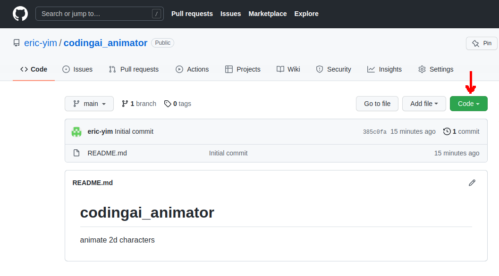
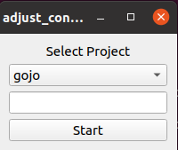
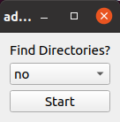
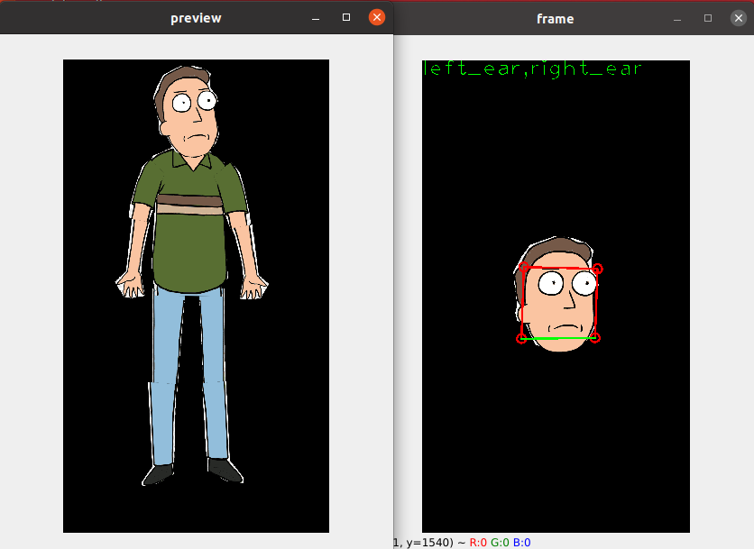
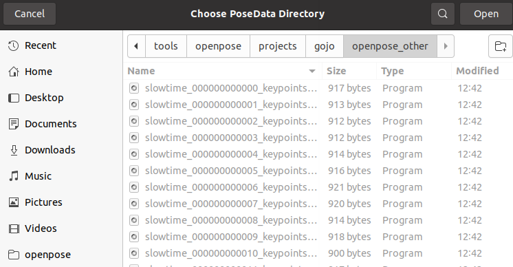
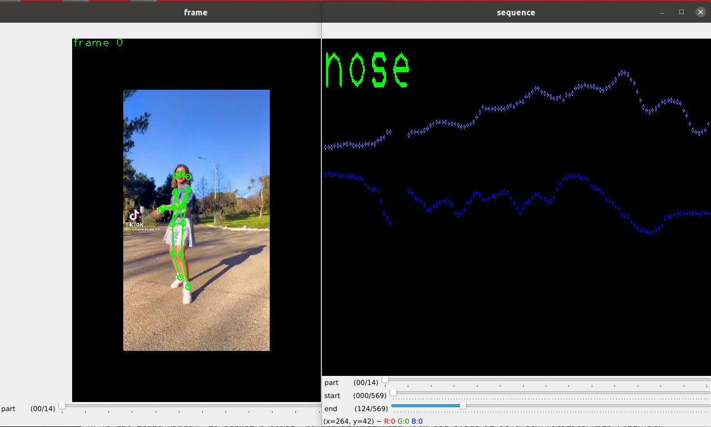
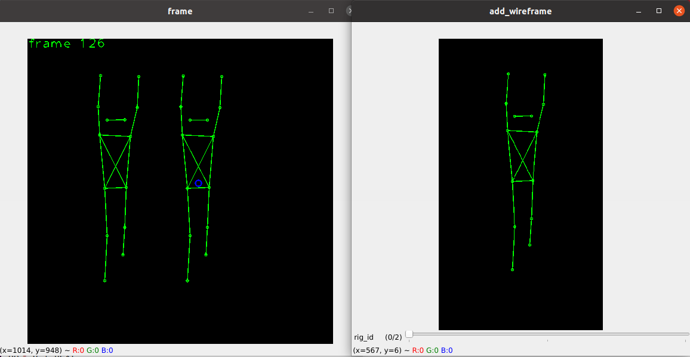

## Overview
This repository includes files to rig and render an animation of a 2d cutout character. These files were tested on Windows 10.

To download the code listed here, if you are not familiar with github, you can also click "code", then "download zip".



## Quickstart Demo
This repository includes a project called "demo". To use it, use the default configuration (without running adjust\_config.exe).

Run the file codingai\_animator.exe. Select an operation from the dropdown menu. If you'd like to create a video with the existing rig, character, and background, select "Render". Your output video will be located in projects/demo/videos

The rest of this document describes each operation.

## Step 0: Starting a Project
You must first specify certain directories, project name, and video file before starting a project.



Select an existing project name or type a new name in the box. Then press "Start".




You must provide 3 directories on your local computer:
- Source Video (where the original video is).
- Characters (where your body part png images are)
- Background (where your background video or image is) This is used in the render step (Step 5) only

You must next select 3 files on local computer (which are files in the above directories):
- Source Video
- Character
- Background

## Step 1: Character Assembly
Labeling the points on the cropped body parts

#### Prereq
Prereq: Before doing this step, you need to create a folder with png images of body parts. These png images must be transparent and they must follow the exact names listed below:

1. left\_ear,right\_ear.png
1. left\_shoulder,left\_hip,right\_hip,right\_shoulder.png
1. left\_shoulder,left\_elbow.png
1. left\_elbow,left\_wrist.png
1. right\_shoulder,right\_elbow.png
1. right\_elbow,right\_wrist.png
1. left\_hip,left\_knee.png
1. left\_knee,left\_ankle.png
1. right\_hip,right\_knee.png
1. right\_knee,right\_ankle.png


#### Commands


- q: quit
- d: next part
- a: prev part
- w: reset current part
- s: save
- e: toggle part name display

There are 2 windows that open for this operation.

In the window called "frame", you will label the points of each part.

In the window called "preview", you will see a preview of what your character will look like once assembled.

Here's an example for labeling the left\_shoulder,left\_elbow.png. In the "frame" window, first, LeftClick the left\_shoulder. Second, LeftClick the left\_elbow. You should now see a rectangle. With your left\_click you can drag either the edges or the corners of the rectangle. You will also see in the "preview" window what effect this has on your character's assembly. In this example, the program expects that you will provide the location of the left\_shoulder first and the left\_elbow second, which matches the name of the png file.

The torso body part is slightly different. You will have to click each of the corners in the proper order: 1) left\_shoulder, 2) left\_hip, 3) right\_hip, 4) right\_shoulder. Note: generally characters look better proportioned if their hips are slightly more narrow than their shoulders. Again you can drag the corners or edges for adjustments.

#### Trouble Shooting
If you are not seeing your character, please try the following:

1. Run adjust\_config.exe 
- Ensure your "Characters Directory" contains the character subfolders
- Ensure you have selected the "Character" subfolder which contains the png images.
2. Ensure the file names listed above match exactly the png images you have prepared.

## Step 2: Import Pose Data
Importing points from Openpose into this project


#### Prereq
This program expects that you have already run openpose to extract the coordinates from some input video. This document does not cover how to install openpose, and this software package does not include openpose.

Please refer to the official documentation for that: https://github.com/CMU-Perceptual-Computing-Lab/openpose

Here's the colab demo: https://colab.research.google.com/github/tugstugi/dl-colab-notebooks/blob/master/notebooks/OpenPose.ipynb#scrollTo=oNASdyyiO65I

<b>Important note: this program expects the outputs of openpose to be scaled.</b>

If you are running openpose from the colab demo, please edit the following line:
```
!cd openpose && ./build/examples/openpose/openpose.bin --video ../video.mp4 --write_json ./output/ --display 0  --write_video ../openpose.avi
```
Replace it with this:
```
!cd openpose && ./build/examples/openpose/openpose.bin --video ../video.mp4 --write_json ./output/ --display 0  --keypoint_scale 3
```
The main difference is the argument <b>--keypoint\_scale 3</b>, which tells openpose to export data in values from 0 to 1.

Also note, if you have a file on your local device, you can upload it to the google colab location. You will then need to edit the "video.mp4" path in the above argument.

For advanced users, once you have gotten used to running openpose, you may want to install openpose on your local computer for convenience.
#### Importing

Assuming you have a folder with the .json files created from openpose, you will now import that directory into your current project. Select the folder and press "Open". This operation merely copies the exact files to your projects folder.

## Step 3: Rig
Manually adjust points using video as reference.


#### Prereq
Prereq: Before doing this step, you should have imported openpose data into your project (Step 2).

#### Frame Window
- q | complete
- w | cycle\_id
- d | next
- a | prev
- s | save
- z | deselect
- x | delete
- e | add

In the frame window, to adjust a point, select it with LeftClick and place it in a new location with LeftClick.

If you'd like to add a joint that doesn't already exist, use the "frame" slider bar on the bottom to choose one of 15 joints (alphabetical).
Then press 'e' and then LeftClick to add that joint to the "frame" window.

If you'd like to delete a joint, select the joint with the LeftClick. Then press 'x' to delete it.

If there are multiple people detected in the video, you can cycle through people with 'w'.

To move forward or backward in the video, press 'd' or 'a', respectively.

#### Sequence Window

- = | all\_joints
- p | joint\_remove\_and\_interp
- i | joint\_sample\_interp
- o | joint\_ema\_smooth
- u | joint\_mass\_del

The "sequence" window allows you to see the points plotted over time. Here, you can do things like interpolate or smooth points.

## Step 4: Building a Scene
Use wireframes to build a scene of different characters.


#### Prereq
You must first create rigs (Step 3).

#### Adding to Scene

- q | complete
- d | next
- a | prev
- z | deselect
- x | delete
- c | copy
- [ | downsize
- ] | upsize
- w | add

There are 2 windows: "frame" window and "add_wireframe" window.

Choose one of the available wireframes using the slider bar at the bottom of the "add_wireframe" window. You can preview the wireframe using the 'a' and 'd' buttons to go forward or backward in time. Once your slider bar is on your desired wireframe, press 'w'. Your wireframe will be imported into the "frame" window. You can repeat this as many times as you like. You can also select a wireframe with LeftClick, press "c", and LeftClick again to copy a wireframe.

You can move a wireframe by pressing LeftClick on a wireframe to select it, then clicking LeftClick somewhere else in the "frame" window. You can downsize or upsize by selecting a wireframe and pressing "[" or "]", respectively. You can delete a wireframe by selecting it with LeftClick, then pressing "x" to delete it.

To quit and save, press "q". If you run the Scene Builder again, it will load the previously saved scene.

Note: Generally, you should create wireframes in the front first, and ones in the back last. The rendering step will draw in reverse order of how you made these.
## Step 5: Render
Create a video from the scene.

#### Prereq
You must first create a scene.

#### Rendering
This step will now create a video from the scene provided and will draw the characters on whatever background you provide. If you'd like to change the background, you can choose it, using the adjust_config (Step 0). Note, the background can be an image or a video file. If it's a video file, the program will use images frame by frame. Please note, you should have a video with the appropriate dimensions as your output.

The output video will be in your projects folder under your project's name in the videos folder (projects/YOUR_NAME/videos/). This video will not include any sound. You can use 3rd-party editing software to place the original sound onto your new video. The frames should pair exactly.

Also, the information for rigging, scene building, and openpose are all in the project folder as well.

## Advanced Operations
You can also manually adjust the scene files with a text editor like Notepad, to specify character (image sets) or create instructions like moving characters horizontally or vertically in the frame.

TBA
